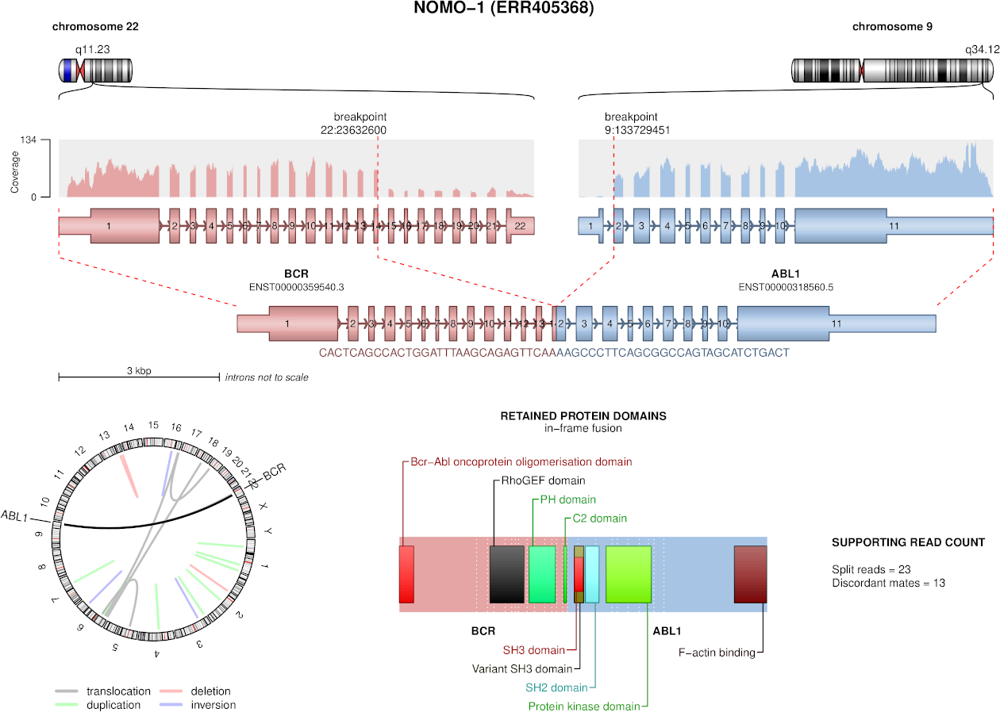
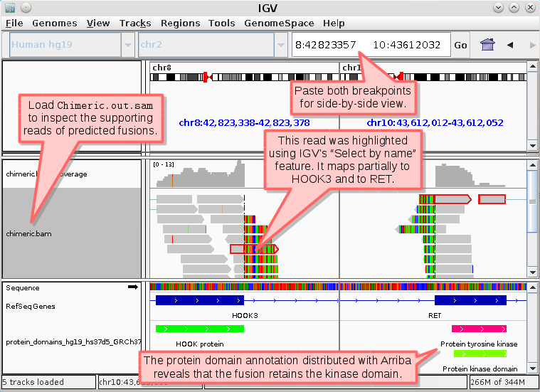

Publication-quality figures
---------------------------

Arriba comes with an R script `draw_fusions.R` that renders publication-quality visualizations of the transcripts involved in predicted fusions. It generates a PDF file with one page for each predicted fusion. Each page depicts the fusion partners, their orientation, the retained exons in the fusion transcript, statistics about the number of supporting reads, and - if the column `fusion_transcript` has a value - an excerpt of the sequence around the breakpoint.



If a gene has multiple transcript variants, the script picks a transcript in the following order of preference:

- transcripts with splice-sites matching the breakpoints

- if alignments are given: the highest expressed transcript as determined by the coverage

- transcripts tagged as `appris_principal`

- transcripts tagged as `appris_candidate`

- transcripts tagged as `appris_alternative`

- transcripts tagged as `CCDS`

If there are still multiple eligible transcripts, then the one with the longest coding sequence or longest non-coding sequence is taken.

**Manual execution**

In order to use the script, [R Project](http://r-project.org/) must be installed. Optionally, a few additional R packages need to be installed, if ideograms, circos plots, and coverage tracks should be drawn. Use the following R commands to install these packages:

```R
install.packages("circlize")
source("https://bioconductor.org/biocLite.R")
biocLite("GenomicAlignments")
biocLite("GenomicRanges")
```

Moreover, [samtools](http://www.htslib.org/) must be installed, if a coverage track should be drawn, because for this purpose the main output file of STAR (`Aligned.out.bam`) needs to be sorted by coordinate and indexed.

The script takes the following inputs:

- a file with fusion predictions from Arriba (`fusions.tsv`)

- the annotation in GTF format

- (optionally) the normal alignments (`Aligned.sortedByCoord.out.bam`), if a coverage track should be drawn

- (optionally) a file with cytobands, if ideograms or circos plots should be drawn

The following command demonstrates the usage. Please refer to section [Command-line options](command-line-options.md#draw_fusionsr) for a complete list of options.

```bash
./draw_fusions.R \
    --fusions=fusions.tsv \
    --alignments=Aligned.sortedByCoord.out.bam \
    --output=fusions.pdf \
    --annotation=GENCODE19.gtf \
    --cytobands=database/cytobands_hg19_hs37d5_GRCh37_v2.0.0.tsv \
    --proteinDomains=database/protein_domains_hg19_hs37d5_GRCh37_v2.0.0.gff3
```

**Execution via Docker**

Use the following command to run the script from the Docker container. Replace `/path/to` with the path to the respective input/output file.

```bash
docker run --rm \
       -v /path/to/output:/output \
       -v /path/to/references:/references:ro \
       -v /path/to/fusions.tsv:/fusions.tsv:ro \
       -v /path/to/Aligned.sortedByCoord.out.bam:/Aligned.sortedByCoord.out.bam:ro \
       -v /path/to/Aligned.sortedByCoord.out.bam.bai:/Aligned.sortedByCoord.out.bam.bai:ro \
       uhrigs/arriba:1.2.0 \
       draw_fusions.sh
```

**Execution via Singularity**

Use the following command to run the script from the Singularity container. Replace `/path/to` with the path to the respective input/output file.

```bash
singularity exec \
       -B /path/to/output:/output \
       -B /path/to/references:/references:ro \
       -B /path/to/fusions.tsv:/fusions.tsv:ro \
       -B /path/to/Aligned.sortedByCoord.out.bam:/Aligned.sortedByCoord.out.bam:ro \
       -B /path/to/Aligned.sortedByCoord.out.bam.bai:/Aligned.sortedByCoord.out.bam.bai:ro \
       docker://uhrigs/arriba:1.2.0 \
       draw_fusions.sh
```

**Execution via Bioconda**

When Arriba was installed via Bioconda, the script `draw_fusions.R` is available in the `$PATH` and can be executed as explained in the section **Manual execution**. The database files (protein domain track, cytobands) are located in `$CONDA_PREFIX/var/lib/arriba`.

Inspection of events using IGV
------------------------------

Inspecting the supporting reads of an event using [IGV](http://software.broadinstitute.org/software/igv/) can help identify alignment artifacts. All the information that Arriba uses as a basis for fusion prediction can be found in the files `Chimeric.out.sam` and `Aligned.out.bam`). By loading these files into IGV, all supporting reads of predicted fusions can be checked for alignment artifacts. (Note that the files first need to be sorted by coordinate and indexed, before they can be loaded into IGV.) Both breakpoints can be opened side-by-side simply by pasting the breakpoint coordinates into the location field separated by white-space. One can zoom in and out the two panes using the `+` and `-` keys. The column `read_identifiers` contains the names of the supporting reads. Reads can be highlighted by name by right-clicking anywhere in one of the panes and choosing `Select by name...`. If you suspect that a predicted event is an alignment artifact, because the alignment quality of the supporting reads looks poor (many mismatches/clipped bases), then you can have IGV search for a better alignment. Right-click a read and choose `Blat read sequence` to perform a sensitive search for alternative alignments that STAR did not find.



